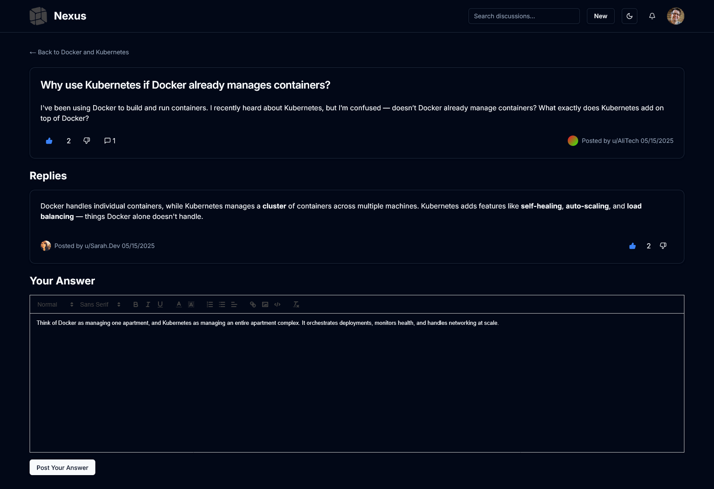
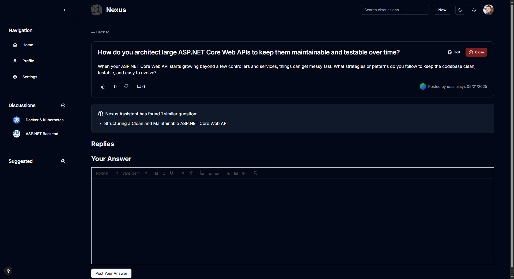

# 📚 Nexus – Collaborative AI-Powered Q&A Platform

Nexus is a discussion-based Q&A platform where users can engage in topic-specific conversations by asking questions and receiving responses from both humans and AI. The system organizes knowledge efficiently while enhancing the user experience with intelligent features like AI-suggested answers.

---

## ✨ Features

- Structured question and answer discussions grouped under topics.
- AI-suggested answers for quick and insightful responses.
- Role-based permissions for managing content.
- Admin dashboard for dynamic website content management.
- Markdown support with sanitized HTML rendering.

---

## 🧠 System Architecture

This system is composed of three main components:

- **Frontend**: Built with [Next.js](https://github.com/AbdelilahBKM/nexus-frontend), providing a fast and interactive user interface.
- **Backend**: Built with [ASP.NET Core](https://github.com/AbdelilahBKM/P2PLearningAPI), managing users, discussions, roles, and question data.
- **Smart API**: Developed with [Python](https://github.com/AbdelilahBKM/FastAPI-w-openAI), responsible for AI-powered suggestions and future intelligent services.

> 📌 Add your architecture diagram here  
> **📸 _Insert System Architecture Diagram_**

---

## 🛠 Technologies Used

| Technology | Purpose |
|------------|---------|
| [Next.js](https://github.com/vercel/next.js) | Frontend Framework |
| [ASP.NET Core](https://github.com/dotnet/aspnetcore) | Backend API |
| [Python (FastAPI or Flask)](https://github.com/tiangolo/fastapi) | Smart features API (AI answers) |
| [Tailwind CSS](https://github.com/tailwindlabs/tailwindcss) | Styling |
| [Shadcn/UI](https://github.com/shadcn/ui) | UI Components |
| [Redux Toolkit](https://github.com/reduxjs/redux-toolkit) | State Management |
| [SqlServer](https://www.microsoft.com/en-us/sql-server/sql-server-downloads) | Database |

---

## 📐 UML Diagrams

### ✅ Use Case Diagram
> _Illustrates the interactions between users (admins, visitors, contributors) and the system._

---

### 📦 Class Diagram
> _Shows the structure of core entities like User, Question, Discussion, Role, Answer._

---

### 🔁 Sequence Diagram
> _Example: Flow for retrieving a suggested answer from the Python API when a question is viewed._

---

## 🖼 Screenshots

### 🏠 Home Page

### 📝 Register Page

### 🔐 Login Page

### 👤 Profile Page

### 💬 Discussion View

### ❓ Ask Question

### ✍️ Answering Question

### ✅ Set Best Answer

### 🧠 Similar Question Suggestions

### 🤖 Suggested Answers by AI

---

## 🌱 Future Improvements

1. **Personalized Content Recommendations**  
   Suggest questions or discussions based on user interests, activity, and expertise.

2. **Auto-tagging & Topic Classification**  
   Automatically suggest tags or categorize questions based on their content.

3. **Gamification & Reputation System**  
   Introduce badges, scores, and achievements to encourage contributions.

4. **Multi-language Support**  
   Enable multilingual support for global audiences.

5. **Real-time Collaboration**  
   Allow live editing or co-answering of questions.

6. **Semantic Search & Question Similarity**  
   Show related questions or auto-detect duplicates.

---

## 🔒 Security Considerations

- Input sanitization to prevent XSS in user-generated content.
- Role-based access control to manage admin privileges.
- Auth token protection via secure storage and HTTP-only cookies.

---

## 📂 Project Structure Overview

